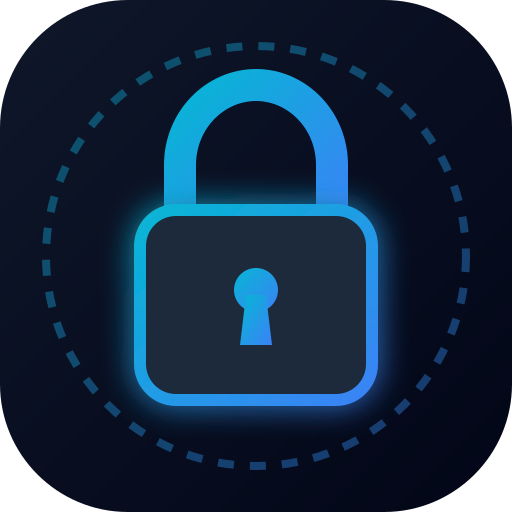

# 📱 ZenLock - Native Android Phone Locker & Focus Chamber

A hardcore, unclosable timed phone locker built with **HTML5, CSS3, JavaScript, Python, and Android Java**.



---

## 🔒 Hardcore Focus & Security Features

- 🛑 **Unbreakable Lock Mode**: When turned ON, emergency unlock is completely disabled. You CANNOT quit until the countdown finishes.
- 🔕 **Hide Notifications (Do Not Disturb)**: Suppresses and hides all incoming notification banners, peeks, and chimes during your lock session.
- 📌 **Screen Pinning / Lock Task Support**: Blocks Home, Recent Apps, and swipe gestures to prevent escaping the app.
- 🛡️ **Android Back-Button Trap**: Prevents the hardware back button from exiting.
- 📱 **Two Ways to Run**:
  1. **Instant Mode**: Save to phone home screen as a standalone PWA + Android App Pinning (Zero build tools required!).
  2. **Native APK**: Full Android Studio project with `ACCESS_NOTIFICATION_POLICY` & `startLockTask()` bridge, with automated GitHub Actions APK compilation.

---

## 🚀 Quick Setup & Transfer

See the complete step-by-step instructions in [TRANSFER_GUIDE.md](TRANSFER_GUIDE.md).

### Quick Local Preview:
```bash
python server.py
```
Open the printed local IP URL on your phone and tap **Add to Home Screen**.
